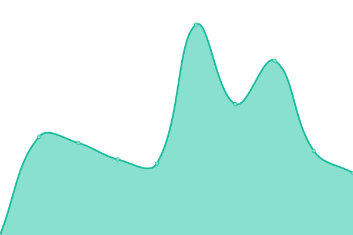

# [📈 Live Status](https://ryanda.github.io/web-upptime): <!--live status--> **🟩 All systems operational**

This repository contains the open-source uptime monitor and status page for [m. ryanda putra](https://ryanda.github.io/web-upptime), powered by [Upptime](https://github.com/upptime/upptime).

With [Upptime](https://upptime.js.org), you can get your own unlimited and free uptime monitor and status page, powered entirely by a GitHub repository. We use [Issues](https://github.com/ryanda/web-upptime/issues) as incident reports, [Actions](https://github.com/ryanda/web-upptime/actions) as uptime monitors, and [Pages](https://ryanda.github.io/web-upptime) for the status page.

<!--start: status pages-->
<!-- This summary is generated by Upptime (https://github.com/upptime/upptime) -->
<!-- Do not edit this manually, your changes will be overwritten -->
<!-- prettier-ignore -->
| URL | Status | History | Response Time | Uptime |
| --- | ------ | ------- | ------------- | ------ |
|  [Jalan Damai](http://jalandamai.org) | 🟩 Up | [jalan-damai.yml](https://github.com/ryanda/web-upptime/commits/master/history/jalan-damai.yml) | 

 10444ms
     
 | 

<a href="https://ryanda.github.io/web-upptime/history/jalan-damai">99.79%</a>
    

|  [Damailah Indonesiaku](https://damailahindonesiaku.net) | 🟩 Up | [damailah-indonesiaku.yml](https://github.com/ryanda/web-upptime/commits/master/history/damailah-indonesiaku.yml) | 

 1122ms
     
 | 

<a href="https://ryanda.github.io/web-upptime/history/damailah-indonesiaku">100.00%</a>
    

|  [Duta Damai](http://dutadamai.id) | 🟩 Up | [duta-damai.yml](https://github.com/ryanda/web-upptime/commits/master/history/duta-damai.yml) | 

 2691ms
     
 | 

<a href="https://ryanda.github.io/web-upptime/history/duta-damai">99.80%</a>
    

<!--end: status pages-->

[**Visit our status website →**](https://ryanda.github.io/web-upptime)

## 📄 License

- Code: [MIT](./LICENSE) © [m. ryanda putra](https://ryanda.github.io/web-upptime)
- Data in the `./history` directory: [Open Database License](https://opendatacommons.org/licenses/odbl/1-0/)
