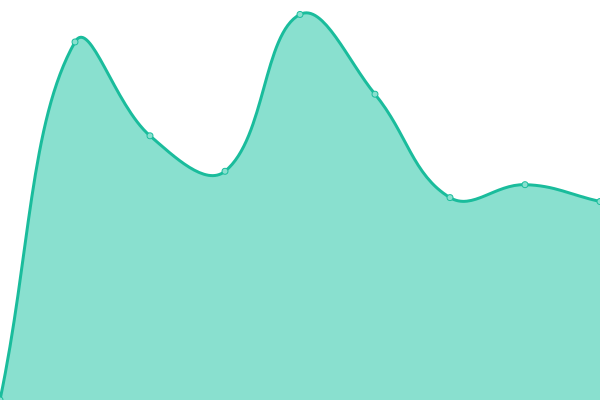

# [📈 Live Status](https://ryanda.github.io/web-upptime): <!--live status--> **🟩 All systems operational**

This repository contains the open-source uptime monitor and status page for [m. ryanda putra](https://ryanda.github.io/web-upptime), powered by [Upptime](https://github.com/upptime/upptime).

With [Upptime](https://upptime.js.org), you can get your own unlimited and free uptime monitor and status page, powered entirely by a GitHub repository. We use [Issues](https://github.com/ryanda/web-upptime/issues) as incident reports, [Actions](https://github.com/ryanda/web-upptime/actions) as uptime monitors, and [Pages](https://ryanda.github.io/web-upptime) for the status page.

<!--start: status pages-->
<!-- This summary is generated by Upptime (https://github.com/upptime/upptime) -->
<!-- Do not edit this manually, your changes will be overwritten -->

| URL                                                     | Status | History                                                                                                           | Response Time                                                                              | Uptime                                                                                                                                                                                                                                         |
| ------------------------------------------------------- | ------ | ----------------------------------------------------------------------------------------------------------------- | ------------------------------------------------------------------------------------------ | ---------------------------------------------------------------------------------------------------------------------------------------------------------------------------------------------------------------------------------------------- |
| [Jalan Damai](http://jalandamai.org)                    | 🟩 Up  | [jalan-damai.yml](https://github.com/ryanda/web-upptime/commits/master/history/jalan-damai.yml)                   |  8003ms          |                     |
| [Damailah Indonesiaku](https://damailahindonesiaku.net) | 🟩 Up  | [damailah-indonesiaku.yml](https://github.com/ryanda/web-upptime/commits/master/history/damailah-indonesiaku.yml) |  1221ms |  |
| [Duta Damai](http://dutadamai.id)                       | 🟩 Up  | [duta-damai.yml](https://github.com/ryanda/web-upptime/commits/master/history/duta-damai.yml)                     |  2242ms           |                      |

<!--end: status pages-->

[**Visit our status website →**](https://ryanda.github.io/web-upptime)

## 📄 License

- Code: [MIT](./LICENSE) © [m. ryanda putra](https://ryanda.github.io/web-upptime)
- Data in the `./history` directory: [Open Database License](https://opendatacommons.org/licenses/odbl/1-0/)
